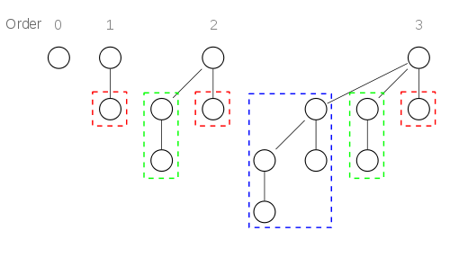
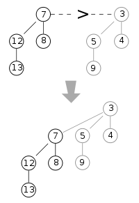
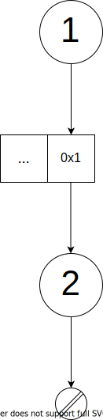
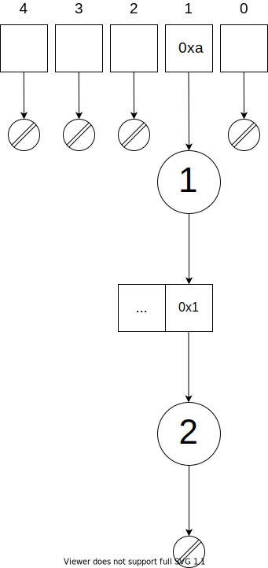
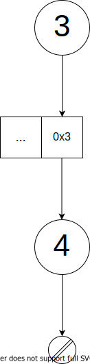
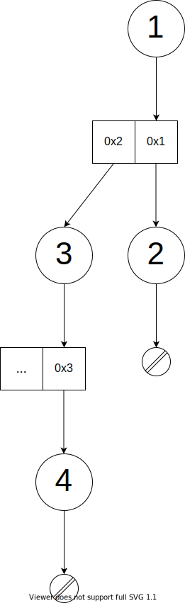
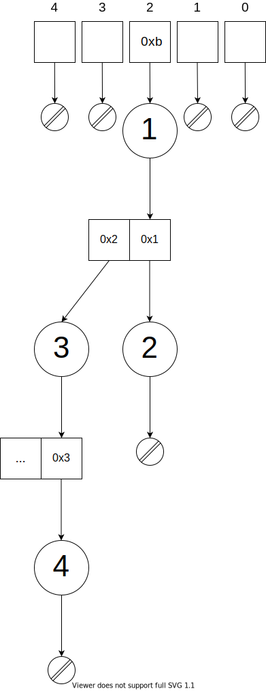

# Proyecto 1: Implementación de Heaps

## Introducción

En este proyecto analizaremos e implementaremos tres variantes de Heap, a saber, Binary Heap, Binomial Heap y Fibonacci Heap. Nuestro objetivo es ofrecer una guía para conocer sus ventajas y desventajas, sus características y cuáles son los problemas en los que podemos aplicarlos.

## Binary Heap

Es una estructura de datos que toma la forma de árbol binario y que cumple la **Propiedad de Heap**: En un max heap para cualquier nodo C, si P es padre de C, P es mayor o igual a C. En un min heap P sería menor o igual a C. Su utilidad está en la implementación de colas prioridad eficientes. Su eficiencia es tal que comunmente las colas de prioridad son llamadas heap, independiente de cual sea la estructura de datos implementada. Adicionalmente a la propiedad de heap, un binary heap debe cumplir con requisito de forma: debe ser un árbol binario completo. Como es de suponer, encontrar el mínimo (o máximo, según sea el caso) toma tiempo constante. Insertar y borrar son $O(log(n))$ y la unión $O(n)$

Algunas aplicaciones de Binary Heap son:
	* El algoritmo Heap Sort utiliza internamente un binary heap para ordenar un arreglo en tiempo $O(nlogn)$.
	* Implementación de colas de prioridad donde no es importante implementar la operación de unión con máxima eficiencia. 
	* El algoritmo de Dijkstra puede utilizar un binary heap para encontrar el camino más corto.	

### Implementación Binary Heap

Para implementar un binary heap uilizamos un arreglo. Al ser binary heap siempre un árbol binario completo no hay necesidad de utilizar punteros y lo almacenamos de manera compacta. Para acceder a los hijos de un nodo particular, lo haremos mediante un par de operaciones aritméticas sobre el índice del padre. Lo mismo podemos hacer para encontrar el padre. Suponiendo que el arreglo está indexado en 0, las relaciones son las siguientes:

* Índice del Hijo derecho: $2i +2$
* Índice del Hijo izquierdo: $2i + 1$
* Índice del Padre: $\bigl\lfloor\frac{i-1}{2}\bigr\rfloor$

### Rendimiento teórico Binary Heap

La siguiente tabla describe la complejidad temporal en notación Big O de algunas de las operaciones soportadas por Binary Heap.

| Operación | Promedio | Peor Caso |
|--|--|--|
| Insertar | $O(1)$ | $O(log(n))$ |
| min(max) | $O(1)$ | $O(log(1))$ |
| Eliminar| $O(log(n))$ | $O(log(n))$ |
| Unión | $O(n+m)$ | $O(n+m)$ |

Donde n y m representan el número de nodos de cada binary heap que forma parte en la operación de unión.

## Binomial Heap

<<<<<<< HEAD
Es una estructura de datos con multiples árboles binomiales que cumplen con la **Propiedad de Heap**: En un max heap para cualquier nodo C, si P es padre de C, P es mayor o igual a C. En un min heap P sería menor o igual a C. Su utilidad está en la implementación de colas prioridad eficientes. Su eficiencia es tal que comunmente las colas de prioridad son llamadas heap, independiente de cual sea la estructura de datos implementada. Adicionalmente a la propiedad de heap, un binary heap debe cumplir con requisito de forma: debe ser un árbol binario completo. Como es de suponer, encontrar el mínimo (o máximo, según sea el caso) toma tiempo constante. Insertar y borrar son $O(log(n))$ y la unión $O(n)$
=======
De manera similar a Binary Heap, un Binomial Heap es una estructura de datos que actúa como cola de prioridad y que además permite la unión de pares de heaps. Análogo a binary heap que toma la forma de un árbol binario completo, un binomial heap toma la forma de otro tipo de árbol, un binomial tree. Otra gran diferencia es que un Binomial Heap es un bosque de binomial trees y está definido de manera recursiva:

* Un binomial tree de orden 0 es un único nodo
* Un binomial tree de orden $k$ tienen una raiz cuyos hijos son binomial trees de órdenes $k-1, k-2, ..., 2, 1, 0$.

 

Notemos además que podemos construir un binomial tree de orden k a partir de dos binomial tree de orden k-1. Simplemente tenemos que agregar un de los árboles como el hijo izquierdo de la raíz del otro árbol. Esta propiedad resulta de vital importancia a la hora de implementar la operación de unión.


>>>>>>> d7828611deb3450db5f68734b509119e36f54e51

Binomial Heap resulta de utilidad en los casos en que sea necesario unir varias colas de prioridad y con relativa frecuencia. En estos casos binary heap no es adecuado.
### Implementación Binomial Heap

Para implementar binomial heap utilizando el menor espacio posible, creamos la estructura `node`. Cada `node` se compone de su propio valor y de un vector con las referencias a los `nodes` hijos. Esto nos permite definir recursivamente los árboles binomiales independiente del orden que tengan. Como es lógico, para representar el Binomial Heap creamos un vector con referencias a cada uno de estos árboles. El índice de cada objeto de este vector se corresponde con el grado del árbol binomial. 

```cpp
struct node
{
    int val;
    vector<node*>* childPtrs;
};
```

Para despejar dudas vamos ejemplificar usando imágenes el comportamiento de nuestra estructura de datos. Supongamos que tenemos nuestro binomial heap vacío y queremos insertar los números 1 y 2. El primer paso es convertir el número 1 en `node`, como se muestra: `node` tiene valor 1 y apunta a `null`, porque no tiene hijos.


Hacemos lo propio para 2, pero al insertar nos damos cuenta que tenemos que generar el árbol binomial de orden 1. Aquí es donde entra en juego el segundo miembro de `node`, el vector de punteros. Aún parecerá innecesario, pero más adelante demostraremos que su uso es ventajoso.


Así el árbol binomial de orden 1 nos queda



y nuestro **Binomial Heap** queda



Para ver más claramente la utilidad del vector de punteros vamos a realizar la operación de unión entre el árbol binomial anterior y otro nuevo con los valores 3 y 4.



**Unión de los dos árboles**



Nos damos cuenta de que nuestra implementación es eficiente, ya que para unir dos árboles solo hizo falta hacer referencia a un árbol ya existente.

El estado actual de nuestro **Binomial Heap** es



### Rendimiento Teórico Binomial Heap

La siguiente tabla describe la complejidad temporal en notación Big O de algunas de las operaciones soportadas por Binomial Heap.

| Operación | Promedio | Peor Caso |
|--|--|--|
| Insertar | $O(1)$ | $O(log(n))$ |
| min(max) | $O(1)$ | $O(log(n))$ |
| Eliminar | $O(log(n))$ | $O(log(n))$ |
| Unión | $O(log(n)+log(m))$ | $O(log(n)+log(m))$ |

Donde n y m representan el número de nodos de cada binary heap que forma parte en la operación de unión.

## Fibonacci Heap

Al ser una estructura que implementa el ADT "mergeable heap" se puede aplicar para muchos de los casos que ya hemos descrito, sin embargo un Fibonacci Heap tiene como ventaja que algunas de sus operaciones se ejecutan en tiempo constante amortizado.
Si lo comparamos con Binomial Heap, Fibonacci Heap tiene una estructura más relajada. La forma de los árboles no es estricta y algunas de sus operaciones se ejecutan de manera perezosa.

### Implementación Fibonacci Heap


### Rendimiento Teórico Fibonacci Heap

La siguiente tabla describe la complejidad temporal en notación Big O de algunas de las operaciones soportadas por Fibonacci Heap.

| Operación | Amortizado |
|--|--|
| Insertar | $O(1)$ | 
| min(max) | $O(1)$ | 
| Eliminar | $O(log(n))$ |
| Unión | $O(1)$ |

